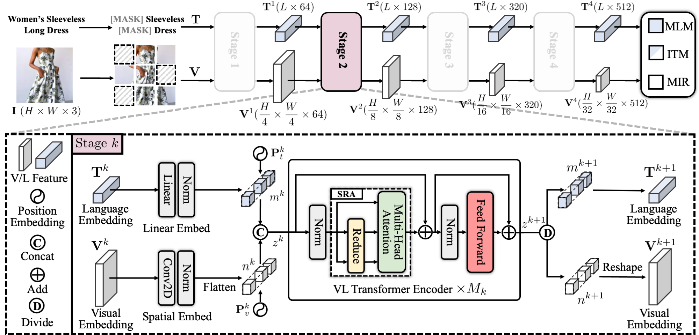

# Masked Vision-Language Transformer in Fashion

- Authors: Ge-Peng Ji^, Mingcheng Zhuge^, Dehong Gao, Deng-Ping Fan#, Christos Sakaridis, and Luc Van Gool
- Accepted by  Machine Intelligence Research 2023
- Link: [arXiv Paper]() (coming soon)
- This project is still work in progress, and we invite all to contribute in making it more acessible and useful. If you have any questions, please feel free to drop us an e-mail (gepengai.ji@gmail.com & mczhuge@gmail.com & dengpfan@gmail.com) or directly report it in the issue or push a PR. Your star is our motivation, let's enjoy it!

# Dataset Preparation

This project conducts several experiments on the public dataset, Fashion-Gen, which contains 260,480 training text-image pairs for training and 35,528 text-image pairs for inference. The MVLT model can directly process the original image and text without any feature engineering pre-processing of the data. However, it is necessary to sort out the storage form of the data to facilitate the dataloader of torch:

Please download the reorganized dataset from [OneDrive](https://anu365-my.sharepoint.com/:u:/g/personal/u7248002_anu_edu_au/EYYvy12woddIgHki0I46j5YBiGLfzjrEEIXaliOlRQJUZQ?e=d5MWBO).

# Prelimilaries

Installing the basic libararies python3.6, pytorch1.8, cuda10.1 on UBUNTU18.04. I did validate the flexibilty on other versions of libraries and systems, but I think it is easy to adaptation with minor changes. 
- Create env via `conda create -n MVLT python=3.6`
- Installing Pytorch via `~/miniconda3/envs/MVLT/bin/python3.6 -m pip install torch==1.8.0+cu111 torchvision==0.9.0+cu111 torchaudio==0.8.0 -f https://download.pytorch.org/whl/torch_stable.html`
- Installing the auxiliary libraries via running `~/miniconda3/envs/MVLT/bin/python3.6 -m pip install -r requirements.txt`
- Downloading the checkpoint of PVT-tiny for pre-training.
- Downloading the checkpoint from [OneDrive](https://anu365-my.sharepoint.com/:u:/g/personal/u7248002_anu_edu_au/EYNQkZ-m01FJrNKQAiKkVLcBg2qvM6EHeJ_I20X7DJ4D8A?e=AEjQXJ) and move them into `./checkpoints/`. Note this tar.gz file contains two weights: `checkpoint_retrieval.pth` and `checkpoint_recognition.pth`.

# Training

- Just run `bash ./scripts_pt_dws/dws_pvlt_exp1.sh`

# Inference

- Downstream retrieval tasks
  - We provide the zero-shot retrieval performance without any finetuning process, and thus, the well-trained weight could be directly used in the retrieval tasks.
  - Just run `bash downstream_retrieval.sh` and then get the prediction results of Image-Text Retrieval (ITR) and Text-Image Retrieval (TIR).

- Downstream recognition tasks
  - This task needs the fine-tuning process because our pre-trained model is not equipped with the classification head.
  - Just run `bash downstream_recognition.sh` and then get the prediction results of Main-Category Recognition (M-CR) and Sub-Category Recognition (S-CR).

# Citation

    @article{ji2022masked,
      title={Masked Vision-Language Transformer in Fashion},
      author={Ji, Ge-Peng and Zhuge, Mingchen and Gao, Dehong and Fan, Deng-Ping and Sakaridis, Christos and Van Gool, Luc},
      journal={Machine Intelligence Research},
      year={2022}
    }

# Acknowlegement

Thanks Alibaba ICBU Search Team and Wenhai Wang ([PVT](https://github.com/whai362/PVT)) for their technical support.